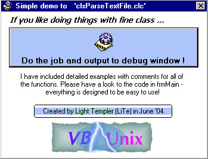



## \_\_When VB OOP meets Unix\_\_\_\_\_ Doing textfiles with a fine class\!

### Description

This carefully designed VB CLASS encapsulates the following UNIX shell commands: CAT, HEAD, TAIL, >> (Append) and some more like GetUniqueTempFileName. With properties like FILTER (grep), CancelParsing, IgnoreLinesWith, LinesToHandle and some more handling of text files is easy and fast implemented into your current project. 

----

A detailed example for every command is included. Error handling is fully implemented, comments are included and code is fine structured. If you are interested in "things behind": Have a closer look to the ring buffer technik used in TAIL() to save memory. btw: We DON'T load the whole file into memory, so even VERY large files can be handled (e.g. catch the last 50 lines from a 2 GByte logfile without any problems ;) ...) 

----

Constructive comments are welcome - votes are motivating ;) ! 

----

Regards__Light Templer

----

UPDATE 1 - Fixed the problem with empty 'IgnoreLinesWith'  Update 2 - The check for missing path/filename was against the wrong var.
 
### More Info
 

             |
---                |---
**Submitted On**   |2004-06-09 13:18:28
**By**             |[Light Templer](https://github.com/Planet-Source-Code/PSCIndex/blob/master/ByAuthor/light-templer.md)
**Level**          |Advanced
**User Rating**    |5.0 (15 globes from 3 users)
**Compatibility**  |VB 5\.0, VB 6\.0
**Category**       |[Files/ File Controls/ Input/ Output](https://github.com/Planet-Source-Code/PSCIndex/blob/master/ByCategory/files-file-controls-input-output__1-3.md)
**World**          |[Visual Basic](https://github.com/Planet-Source-Code/PSCIndex/blob/master/ByWorld/visual-basic.md)
**Archive File**   |[\_\_When\_VB\_179073982004\.zip](https://github.com/Planet-Source-Code/light-templer-when-vb-oop-meets-unix-doing-textfiles-with-a-fine-class__1-54281/archive/master.zip)

